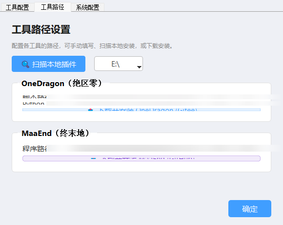
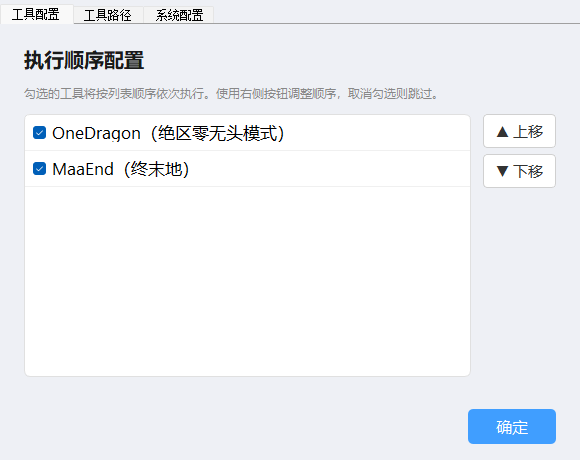
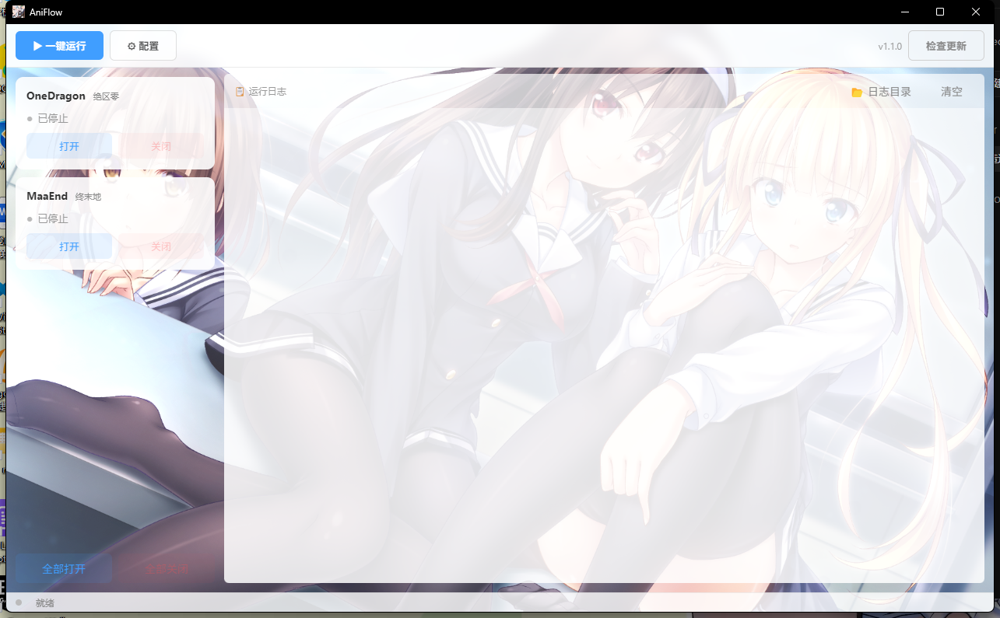
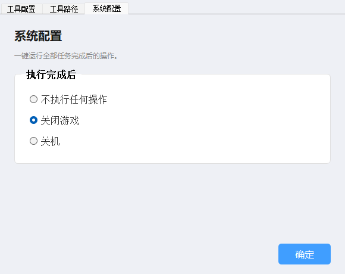

# game-sky

绝区零 (Zenless Zone Zero) + 终末地 (Endfield) 自动化调度工具。

整合 [OneDragon](https://gitee.com/one-dragon/ZenlessZoneZero-OneDragon)（绝区零）和 [MaaEnd](https://github.com/MaaXYZ/MaaEnd)（终末地），提供统一的可视化管理界面和一键运行管道。

## 快速开始

### 下载

从 [Releases](https://github.com/ace-yong/game-sky/releases) 下载最新版 `game-sky.exe`，放在任意目录，双击运行。

首次启动会提权（管理员权限），并在 exe 同级创建 `game-sky/` 数据目录：

```
game-sky.exe
game-sky/
├── config/
│   └── settings.json     ← 配置文件（自动生成）
├── logs/                  ← 执行日志
└── tools/                 ← 下载的自动化工具
```

### 配置工具路径



点击 **⚙ 配置 → 工具路径**，有三种方式设置：

**方式一：扫描本地安装**
选择盘符，点击「扫描本地插件」，自动检测 `onedragon` / `MaaEnd` 目录。

**方式二：单独检测**
每条路径输入框右侧有「检测」按钮，只检测该项。

**方式三：下载安装**
如果本地没有安装，点击「📥 下载并安装」自动拉取：
- OneDragon：从 Gitee `git clone`，自动 `uv sync` 安装依赖
- MaaEnd：从 GitHub 最新 Release 下载解压

> **注意：** OneDragon 下载需要系统已安装 Git。

### 配置管道顺序



点击 **⚙ 配置 → 工具配置**，勾选要执行的工具，拖动调整执行顺序。

| 选项 | 说明 |
|------|------|
| OneDragon（绝区零无头模式） | 自动启动 ZZZ 并执行日常任务，完成后自动退出 |
| MaaEnd（终末地） | 自动启动 Endfield 并执行日常，超时退出 |

### 一键运行



点击 **▶ 一键运行**，按配置的顺序依次执行。右侧日志实时显示工具输出。

### 执行完成后动作



点击 **⚙ 配置 → 系统配置**，设置全部任务完成后的行为：

| 选项 | 行为 |
|------|------|
| 不执行任何操作 | 只显示完成通知 |
| 关闭游戏 | 关闭 MaaEnd / Endfield 进程 |
| 关机 | 30 秒倒计时关机（带提示） |

## 独立启动

左侧列表每个工具可以单独「打开」/「关闭」，不依赖管道。

## 命令行

```bash
game-sky.exe                    # GUI 模式
python main.py daily           # 执行日常任务
python main.py weekly          # 执行周常任务
python main.py schedule        # 定时调度模式
python main.py list            # 查看账号列表
python main.py config          # 查看当前配置
python main.py start zzz       # 启动指定游戏
python main.py stop all        # 停止全部
python main.py status          # 查看状态
```

## 从源码运行

```bash
git clone https://github.com/ace-yong/game-sky.git
cd game-sky
pip install -r requirements.txt
python gui.py
```

## 目录结构

```
game-sky/
├── gui.py                    # PyQt5 主界面
├── main.py                   # 命令行入口
├── src/
│   ├── process_manager.py    # 进程管理 & 管道执行
│   ├── config_manager.py     # 配置管理
│   ├── executor.py           # 任务执行器
│   ├── tool_invoker.py       # 工具调用
│   └── scheduler.py          # 定时调度
├── config/
│   ├── settings.example.json # 配置模板
│   └── accounts.example.json # 账号模板
└── game-sky.spec              # PyInstaller 打包配置
```

## 打包

```bash
pip install PyInstaller
python -m PyInstaller game-sky.spec
# 输出: dist/game-sky.exe
```

## 技术栈

- **Python 3.12** + **PyQt5**（GUI）
- **PyInstaller**（打包单文件 exe）
- 管理员权限提权（`ctypes.windll.shell32.ShellExecuteW`）
- 后台线程执行管道，`QApplication.processEvents` 保持 UI 响应

---

如果这个项目对你有帮助，欢迎点个 ⭐ Star 支持一下！
